# 🚀 CareerPilot AI

## AI-Powered Career Intelligence Platform

CareerPilot AI is a full-stack AI-powered career platform designed to help students and job seekers understand their career readiness, improve their resumes, analyze job compatibility, identify skill gaps, and practice interviews with AI.

---

## 🎯 Why CareerPilot AI?

Job seekers often struggle to understand:

- Whether their resume is strong enough
- Which skills they are missing for a specific job
- Whether their resume matches a job description
- Which ATS keywords they should include
- What interview questions they should prepare
- How well they perform during an interview

CareerPilot AI brings these capabilities together in one platform using AI.

---

# ✨ Key Features

### 📄 AI Resume Analysis

Upload your PDF resume and receive AI-powered analysis including:

- Resume score
- Professional summary
- Skills identified from the resume
- Strengths
- Skill gaps
- Resume improvement suggestions
- Suitable job roles

---

### 💼 AI Job Matching

Enter a job description and analyze how well your resume matches the position.

CareerPilot AI provides:

- Job compatibility score
- Matched skills
- Missing skills
- ATS keywords
- Strengths
- Personalized recommendations

---

### 🎯 Skill Gap Analysis

Identify the skills you need to improve based on the target job.

This helps users understand the difference between their current skill set and the requirements of a desired role.

---

### 🤖 AI Interview Preparation

Generate personalized interview preparation based on:

- Resume
- Target job
- Job description

The platform generates:

- Technical questions
- Resume-based questions
- Behavioral questions
- Topics to revise
- Interview tips

---

### 🎤 AI Mock Interview

Practice interviews with an AI-powered mock interview system.

Features include:

- AI-generated interview questions
- Voice-based question interaction
- Voice answer input using browser speech recognition
- AI evaluation of answers
- Communication score
- Technical score
- Relevance score
- Question-level feedback
- Better answer suggestions
- Final interview score

---

### 🔐 Authentication

CareerPilot AI uses JWT-based authentication.

Users can:

- Register
- Login
- Access protected features
- Refresh authentication tokens
- Logout securely

---

# 🖼️ Application Screenshots

## 📝 Sign Up

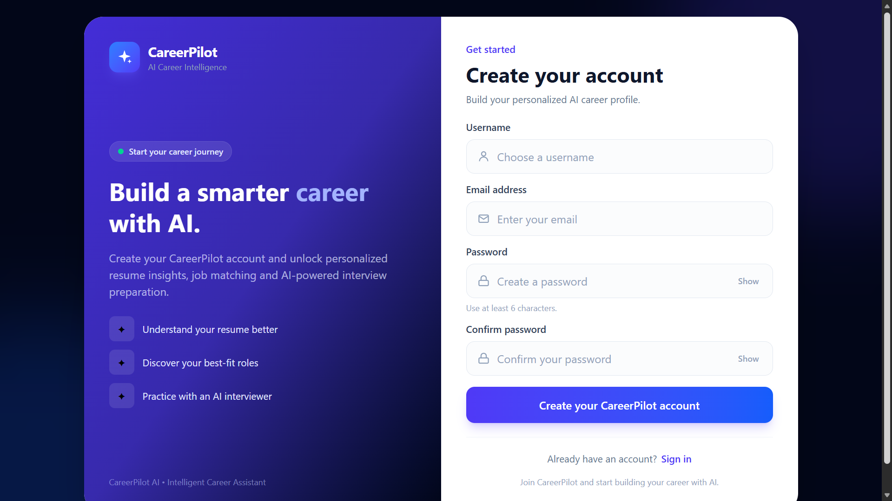

---

## 🔐 Login

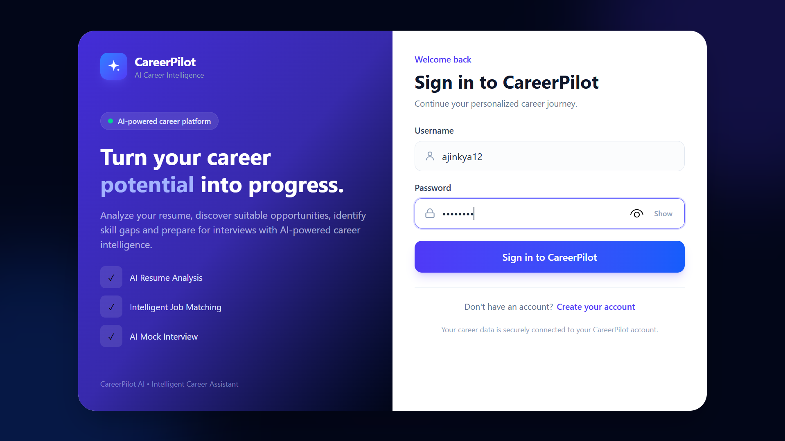

---

## 📊 Dashboard

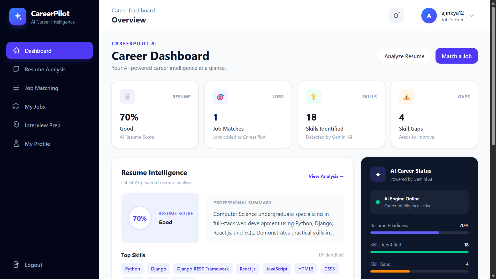

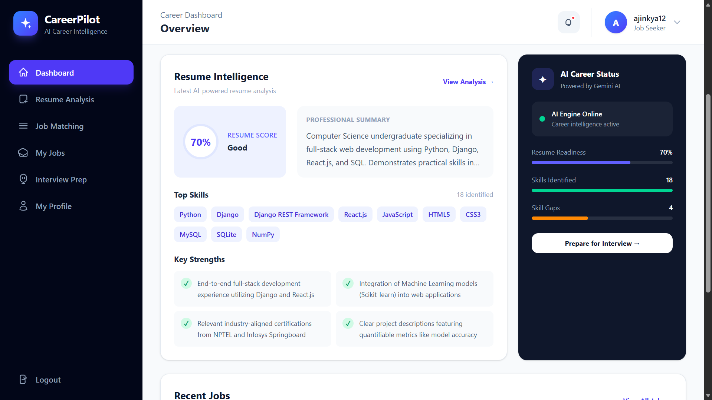

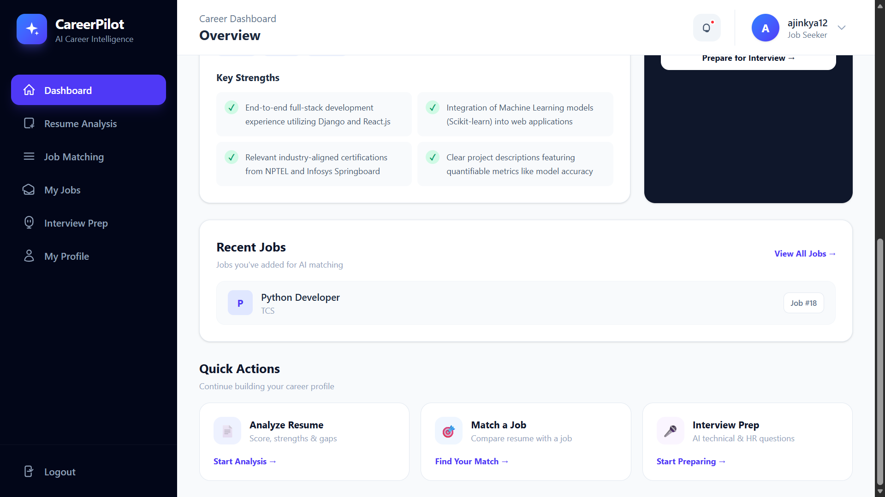

---

## 📄 AI Resume Analysis

### Resume Analysis Overview

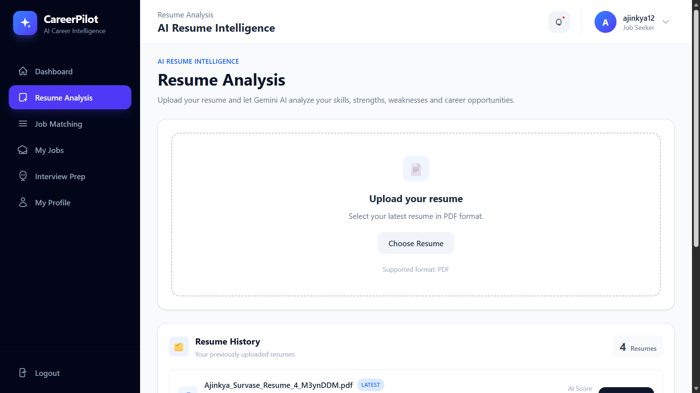

### Resume Score and Summary

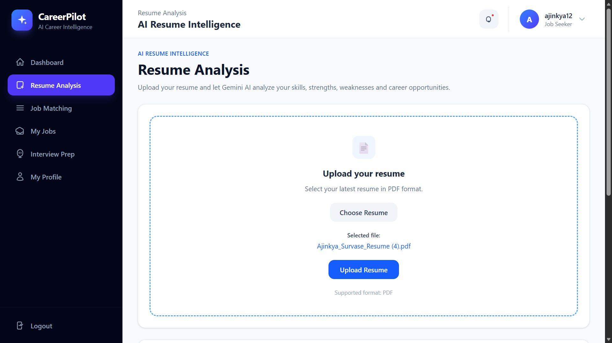

### Skills and Strengths

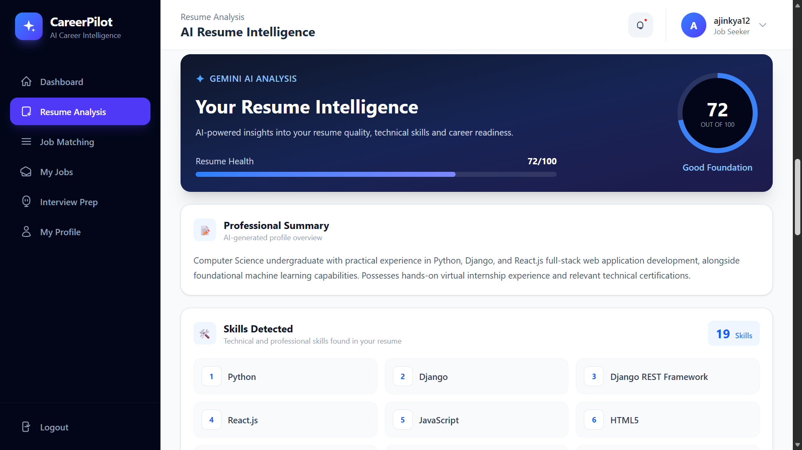

### Skill Gaps

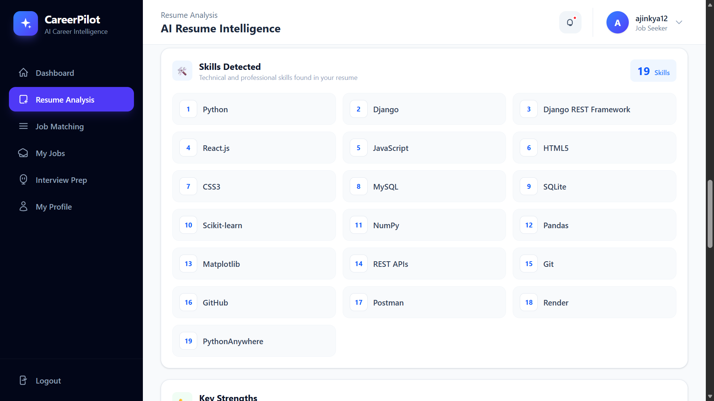

### Improvement Suggestions

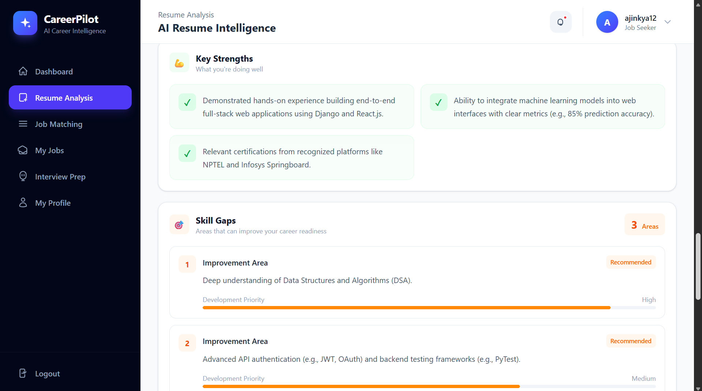

### Suitable Job Roles

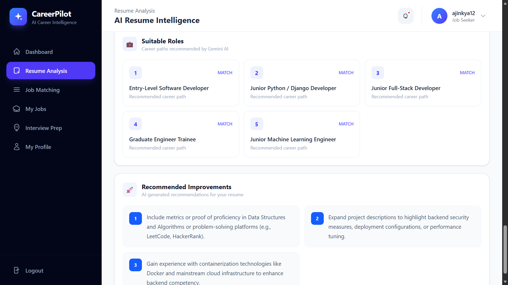

---

## 💼 AI Job Matching

### Job Matching

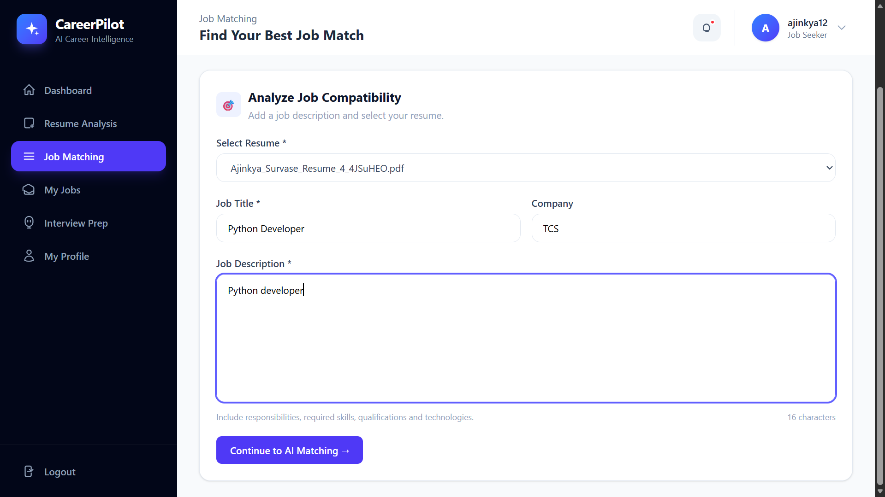

### Job Match Analysis

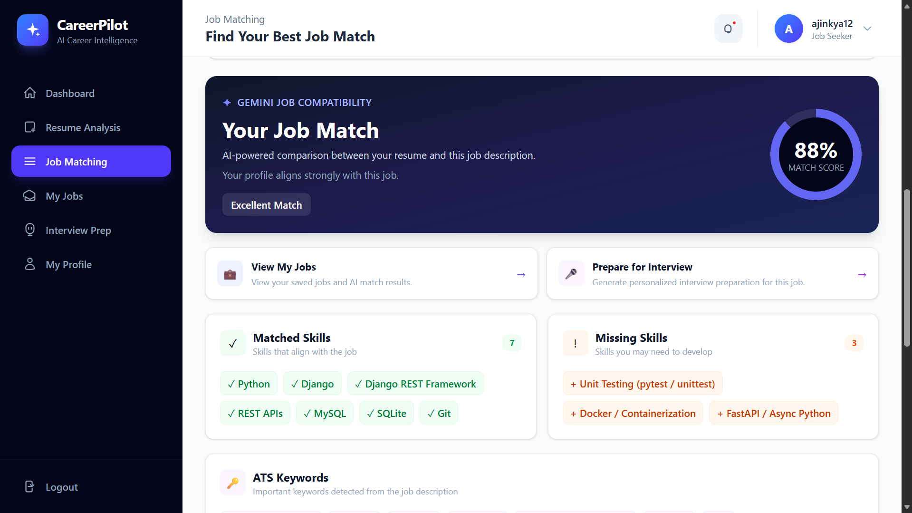

---

## 📋 My Jobs


---

## 🤖 Interview Preparation

### Interview Preparation

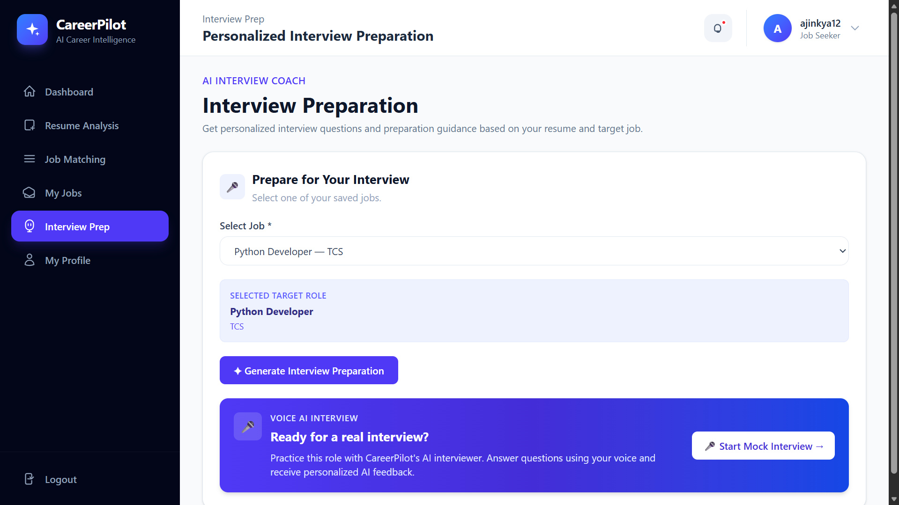

### Personalized Questions

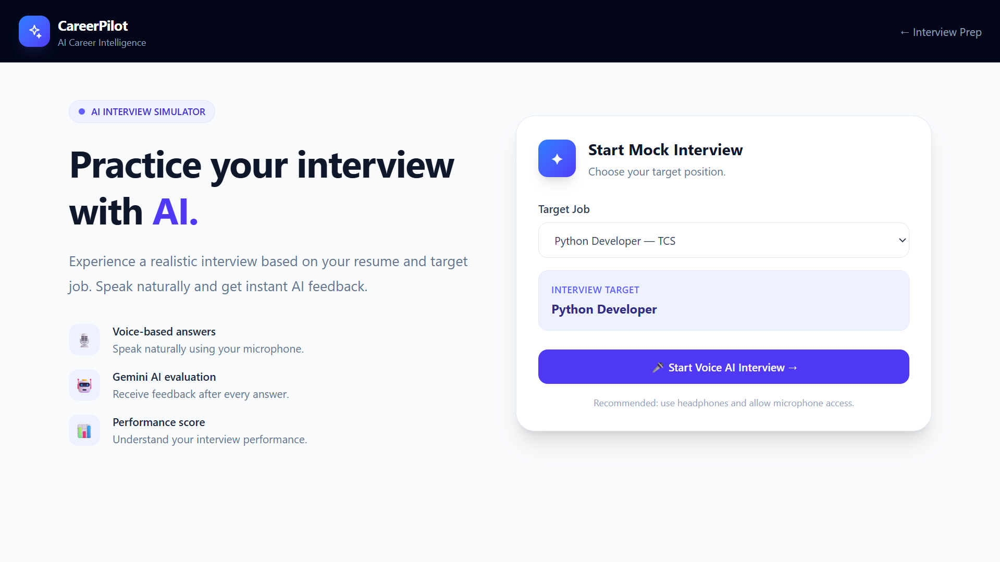

### Interview Topics and Tips

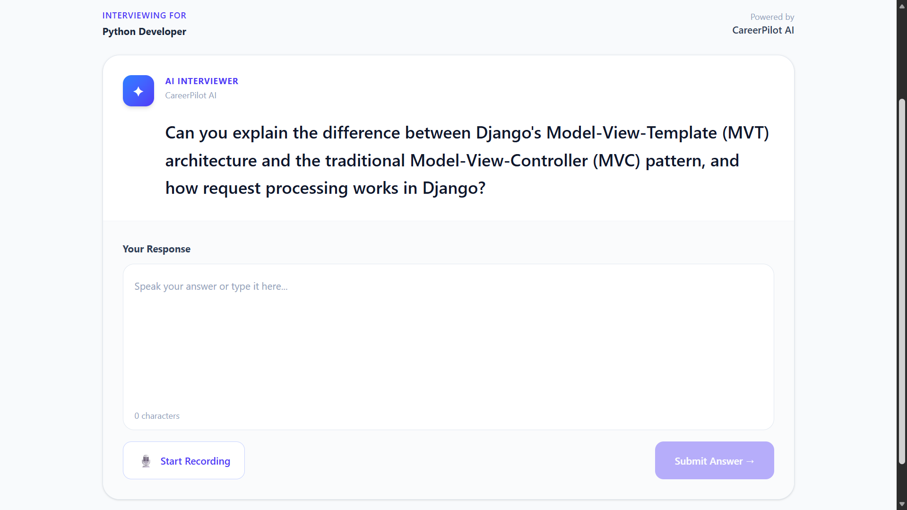

---

# 🛠️ Tech Stack

### Frontend

- React.js
- Vite
- Tailwind CSS
- Axios
- React Router

### Backend

- Python
- Django
- Django REST Framework
- Simple JWT

### Database

- MySQL

### Artificial Intelligence

- Google Gemini API
- Gemini LLM
- Structured JSON AI responses

### Resume Processing

- PyMuPDF

### Development Tools

- Visual Studio Code
- Thunder Client
- Git
- GitHub

---

# 🏗️ Project Architecture

```text
CareerPilot AI
│
├── React Frontend
│   └── React + Vite + Tailwind CSS
│
├── Django Backend
│   └── Django REST Framework
│
├── Authentication
│   └── JWT
│
├── Resume Processing
│   └── PyMuPDF
│
├── AI Engine
│   └── Google Gemini
│
└── Database
    └── MySQL


🔄 Application Flow

User
 │
 ▼
React Frontend
 │
 │ REST API
 ▼
Django REST Framework
 │
 ├── Authentication
 │
 ├── Resume Processing
 │
 ├── Job Matching
 │
 └── Interview System
 │
 ├───────────────┐
 ▼               ▼
MySQL        Gemini AI


📂 Project Structure

CareerPilot-AI/
│
├── backend/
│   ├── accounts/
│   ├── ai/
│   ├── jobs/
│   ├── resumes/
│   ├── config/
│   ├── manage.py
│   └── .gitignore
│
├── frontend/
│   ├── src/
│   │   ├── components/
│   │   ├── pages/
│   │   ├── services/
│   │   └── utils/
│   ├── package.json
│   └── vite.config.js
│
├── .gitignore
└── README.md


🔑 Authentication Flow
CareerPilot AI uses JWT authentication.

User
 │
 ├── Register
 │
 ▼
Login
 │
 ▼
JWT Access Token
 │
 ▼
Protected API Requests
 │
 ▼
Backend Authentication
 │
 ▼
Authorized User


⚙️ Local Setup
1. Clone the repository
git clone https://github.com/ajinkyasurvase1212/CareerPilot-AI.git
cd CareerPilot-AI


🔧 Backend Setup
2. Navigate to backend
cd backend
3. Create virtual environment
python -m venv venv
4. Activate virtual environment

Windows:
venv\Scripts\activate

5. Install dependencies
pip install django djangorestframework djangorestframework-simplejwt mysqlclient python-dotenv pymupdf google-genai django-cors-headers

6. Configure environment variables

Create:

backend/.env

Add:

GEMINI_API_KEY=your_gemini_api_key
DJANGO_SECRET_KEY=your_django_secret_key

DB_NAME=careerpilot
DB_USER=root
DB_PASSWORD=your_mysql_password
DB_HOST=localhost
DB_PORT=3306

⚠️ Never commit your .env file or API keys to GitHub.

7. Run migrations
python manage.py migrate
8. Start Django server
python manage.py runserver

Backend:

http://127.0.0.1:8000/
🎨 Frontend Setup

Open another terminal.

9. Navigate to frontend
cd frontend
10. Install dependencies
npm install
11. Create frontend environment file

Create:

frontend/.env

Add:

VITE_API_BASE_URL=http://127.0.0.1:8000/api
12. Start React application
npm run dev

Frontend will normally run at:

http://localhost:5173/

🔐 Security

CareerPilot AI keeps sensitive credentials outside the frontend source code.

Environment variables are used for:

Gemini API key
Django secret key
Database credentials

Sensitive .env files are excluded through .gitignore.

📊 Main Modules
Module	Purpose
Authentication	User registration and JWT login
Resume Analysis	AI-powered resume evaluation
Job Matching	Resume vs job compatibility
Skill Gap	Identify missing skills
ATS Analysis	Identify important job keywords
Interview Preparation	Personalized interview questions
Mock Interview	AI-powered interview simulation
Profile	User career information


🧠 AI Capabilities

CareerPilot AI uses Google Gemini to perform tasks such as:

Resume
   ↓
AI Analysis
   ↓
Skills + Strengths + Gaps
   ↓
Target Job
   ↓
Compatibility Analysis
   ↓
Interview Preparation
   ↓
AI Mock Interview
   ↓
Evaluation + Feedback


🤖 Gemini AI Integration

Google Gemini is used as the AI engine of CareerPilot AI.
Gemini powers:

Resume analysis
Skill extraction
Skill-gap identification
Job compatibility analysis
ATS keyword identification
Interview question generation
Mock interview question generation
Interview answer evaluation
Personalized career feedback

The Gemini API key is stored securely in backend environment variables.

💡 What Makes CareerPilot AI Different?
Instead of providing only resume analysis, CareerPilot AI connects multiple stages of the job-search journey.

Resume
   │
   ▼
Resume Analysis
   │
   ▼
Skill Gap Identification
   │
   ▼
Job Matching
   │
   ▼
ATS Keywords
   │
   ▼
Interview Preparation
   │
   ▼
Mock Interview
   │
   ▼
AI Evaluation
   │
   ▼
Personalized Feedback

This creates an end-to-end AI-powered career preparation platform.

🚀 Future Enhancements
Potential future improvements include:

Live job search integration
LinkedIn job integration
AI resume builder
AI cover letter generator
Personalized learning roadmap
Job application tracking
Career recommendation engine
Advanced analytics dashboard
Cloud deployment
Email notifications
More advanced voice interview capabilities

🎓 Project Purpose
CareerPilot AI was developed as a practical full-stack AI project demonstrating the integration of:

Artificial Intelligence
Large Language Models
Full-stack web development
REST APIs
Authentication
Database management
Resume processing
AI-based career recommendations


👨‍💻 Author

Ajinkya Survase
Computer Science & Engineering

Technologies
Python Django React MySQL Gemini AI Tailwind CSS REST API JWT